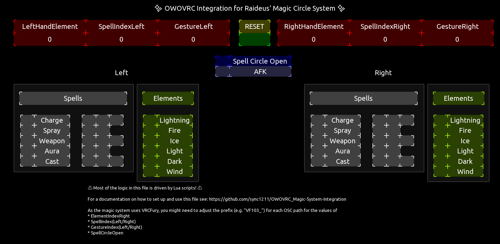

# OWOVRC Magic System Integration

This repository contains config files for [OWOVRC](https://github.com/sync1211/owoskin-vrc) and [TouchOSC](https://hexler.net/touchosc) for adding haptic feedback to [Raideus's Magic Circle System](https://jinxxy.com/Raideus/Magic) via the [OWO Suit](https://owogame.com/)

>**NOTE:** The configuration currently only supports effects on the right hand.

>**NOTE:** These presets are still in alpha. There may be bugs.

## Installation

* Import `oscPresets.json` into [OWOVRC's Presets effect](https://github.com/sync1211/owoskin-vrc/wiki/Effects#presets)
* Open `magic-system.tosc` into TouchOSC

## Troubleshooting

### TouchOSC reacts to VRChat parameters but ignores parameters of the magic system
Update the VRCFury prefix on the parameters' OSC paths in TouchOSC.

Use the avatar debug window in VRChat to view the prefix your avatar uses.

The prefix usually has the format `VF123_`.

### TouchOSC does not react to any parameters

Check if the receiver port in TouchOSC is correct. (`Edit` > `Connections` > `OSC`)

Make sure there are no other applications listening on the same port.

It is recommended to use a OSC routing application, such as [VRCOSC](https://vrcosc.com/) or [VRCRouter](https://github.com/valuef/VRCRouter) to avoid port conflicts.

## Credits

Thanks to Zenta for helping design the sensations.
